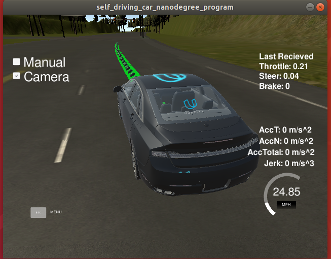
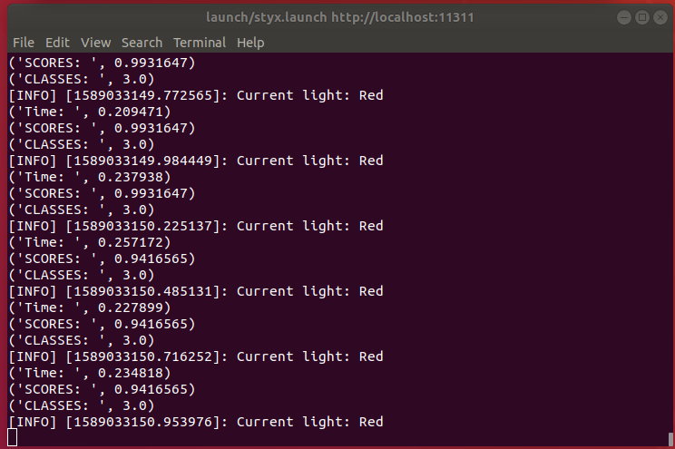
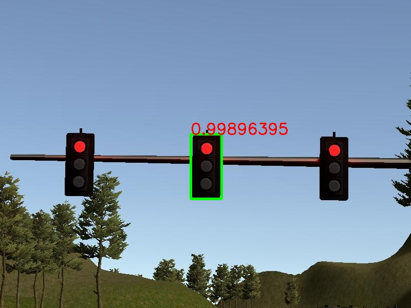
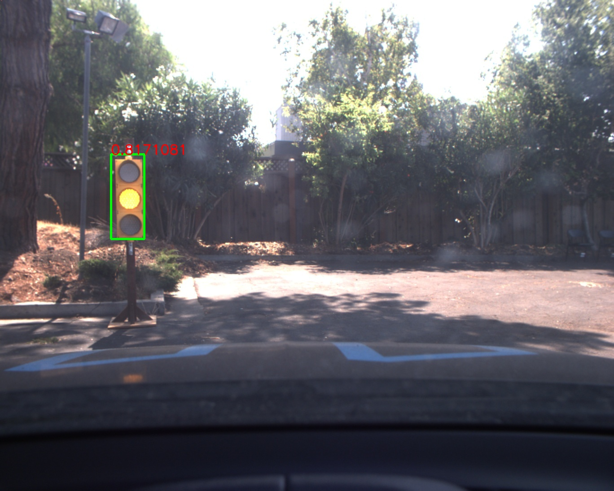

# Udacity Self-Driving Car Nanodegree：Capstone

[](http://www.udacity.com/drive)

Individual 
---

* [Zijun Sha](https://github.com/doublepoints) (doublepoints@outlook.com)

This is the project repository for the final project of the Udacity Self-Driving Car Nanodegree: Programming a Real Self-Driving Car.




## Table of Contents
- [Overview](#Overview)
- [ROS Nodes](#ROS-Nodes)
- [Traffic Light Detection](#Traffic-Light-Detection)1
- [Waypoint Updater](#Waypoint-Updater)
- [Drive by Wire Controller](#Drive-by-Wire-Controller)
- [Getting Started](#Getting-Started)
- [Native Installation](#Native-Installation)
- [Docker Installation](#Docker-Installation)
- [Usage](#Usage)
- [Real word testing](#Real world testing)

Overview
---
This repository contains the code for the final project of the [Udacity Self-Driving Car Nanodegree](https://www.udacity.com/course/self-driving-car-engineer-nanodegree--nd013): Programming a Real Self-Driving Car by individual.

Carla's system consists of a set of components implemented and deployed on [ROS](http://www.ros.org/). And there are 3 parts to be integrated into the whole system. They are ***Perception***, ***Planning*** and  ***Control***:

Since Udacity already provides the basic execution framework, the following 3 nodes shuold be implemented.

* [Traffic Light Detection](#traffic-light-detection): Part of the *perception* . It is responsible for detecting traffic lights as well as classifying the state.

* [Waypoint Updater](#waypoint-updater): Part of the *planning* . It is responsible for generating trajectories considering the detected  traffic lights in the environment.

* [Drive by Wire Controller](#drive-by-wire-controller): Part of the *control* . It is responsible for translating the [Twist Messages](https://docs.ros.org/api/geometry_msgs/html/msg/Twist.html) generated by the [waypoint follower](./ros/src/waypoint_follower) into throttle, brake and steering values.

ROS Nodes 
---
The following 3 nodes (traffic light detection, Waypoint update and DBW) will be introduced seperately.

### [Traffic Light Detection](https://github.com/williamhyin/Udacity-Traffic-Light-Classification)

The [traffic light detection node](./ros/src/tl_detector) is in charge of  detecting incoming traffic lights and classifying the state. 

The node subscribes 3-4 topics:
* **/base_waypoints:**  the complete list of waypoints for the course. 
* **/current_pose:**  the current position of the vehicle.
* **/image_color:**  the RGB image stream from the car's camera. These images are used to determine the color of upcoming traffic lights.
* **/vehicle/traffic_lights:** the (x, y, z) coordinates of all traffic lights. (only in simulator).


The [detector](./ros/src/tl_detector/light_classification/tl_classifier.py) uses [Tensorflow](https://tensorflow.org) to run a variant of a [Single Shot MultiBox Detector](https://arxiv.org/abs/1512.02325) that uses as feature extractor [InceptionV2](https://arxiv.org/abs/1512.00567). The model weights used by the included graph are pre-trained on the [COCO Dataset](http://cocodataset.org) that already contains the traffic light category and provided by the [Tensorflow Object Detection API](https://github.com/tensorflow/models/blob/master/research/object_detection).

In this model, three different classes (GREEN, YELLOW, RED) are  *fine-tuned*  for different states of traffic signals, and the target detection, positioning and classification are folded into a single **end-to-end model** .

Two models are fine-tuned for the task at end using labelled images from various sources, including the [Udacity Simulator](https://github.com/udacity/CarND-Capstone/releases), the [Udacity Training Bag](https://s3-us-west-1.amazonaws.com/udacity-selfdrivingcar/traffic_light_bag_file.zip) and images captured by Carla from real runs at the test lot of Udacity (Download [here](https://drive.google.com/file/d/0B2_h37bMVw3iYkdJTlRSUlJIamM/view?usp=sharing)). 




The results of traffic light detection in simulator and Carla.

| Classes | Traffic light |
| ------- | :------------ |
| 1       | Green         |
| 2       | Red           |
| 3       | Yellow        |


### Waypoint Updater

The waypoint updater node can generate a trajectory in terms of waypoints so that the [waypoint follower](./ros/src/waypoint_follower) can generate the correct [Twist Messages](https://docs.ros.org/api/geometry_msgs/html/msg/Twist.html) consumed by the [DBW Node](./ros/src/twist_controller/dbw_node.py). It can also subscribes to the `/traffic_waypoint` topic published by the [Traffic Light Detection Node](#Traffic Light Detection) in order to adjust the waypoints in the presence of a red light:

Finally the node publishes the list of waypoints ahead of the vehicle to the `/final_waypoints` topic.


### Drive by Wire Controller

Udacity's self-driving car Carla is based on drive-by-wire (DBW) system, which controls the throttle, brake, and steering electronically.

The goal for this part of the project is to implement the drive-by-wire node (`dbw_node.py`) which will subscribe to `/twist_cmd` and use various controllers to provide appropriate throttle, brake, and steering commands. The node subscribes to the `/current_velocity` topic along with the `/twist_cmd` topic to receive target linear and angular velocities (generated by the waypoint follower node from the waypoints published by the [waypoint updater](#waypoints-updater). The [DBW node](./ros/src/twist_controller/dbw_node.py) primarily defines the communication interface.  This node publishes throttle, brake, and steering commands to the `/vehicle/throttle_cmd`, `/vehicle/brake_cmd`, and `/vehicle/steering_cmd topics`.  The [twist_controller](./ros/src/twist_controller/twist_controller.py) contains the algorithms used to generate the control values.


Getting Started
---

Please use **one** of the two installation options, either native **or** docker installation.

### Native Installation

* Be sure that your workstation is running Ubuntu 16.04 Xenial Xerus or Ubuntu 14.04 Trusty Tahir. [Ubuntu downloads can be found here](https://www.ubuntu.com/download/desktop).

* If using a Virtual Machine to install Ubuntu, use the following configuration as minimum:
  * 2 CPU
  * 2 GB system memory
  * 25 GB of free hard drive space

  The Udacity provided virtual machine has ROS and Dataspeed DBW already installed, so you can skip the next two steps if you are using this.

* Follow these instructions to install ROS
  * [ROS Kinetic](http://wiki.ros.org/kinetic/Installation/Ubuntu) if you have Ubuntu 16.04.
  * [ROS Indigo](http://wiki.ros.org/indigo/Installation/Ubuntu) if you have Ubuntu 14.04.
  
* [Dataspeed DBW](https://bitbucket.org/DataspeedInc/dbw_mkz_ros)
  
  * Use this option to install the SDK on a workstation that already has ROS installed: [One Line SDK Install (binary)](https://bitbucket.org/DataspeedInc/dbw_mkz_ros/src/81e63fcc335d7b64139d7482017d6a97b405e250/ROS_SETUP.md?fileviewer=file-view-default)
  
* Download the [Udacity Simulator](https://github.com/udacity/CarND-Capstone/releases).

  *Note: Ubuntu 18.04 TLS is also suitable for this project, the step is same as Ubuntu 16.04. 

### Docker Installation
[Install Docker](https://docs.docker.com/engine/installation/)

Build the docker container
```bash
docker build . -t capstone
```

Run the docker file
```bash
docker run -p 4567:4567 -v $PWD:/capstone -v /tmp/log:/root/.ros/ --rm -it capstone
```

### Port Forwarding
To set up port forwarding, please refer to the "uWebSocketIO Starter Guide" found in the classroom (see Extended Kalman Filter Project lesson).

### Usage

1. Clone the project repository
```bash
git clone https://github.com/udacity/CarND-Capstone.git
```

2. Install python dependencies
```bash
cd CarND-Capstone
pip install -r requirements.txt
```
3. Make and run styx
```bash
cd ros
catkin_make
source devel/setup.bash
roslaunch launch/styx.launch
```
4. Run the simulator

### Real world testing
1. Download [training bag](https://s3-us-west-1.amazonaws.com/udacity-selfdrivingcar/traffic_light_bag_file.zip) that was recorded on the Udacity self-driving car.
2. Unzip the file
```bash
unzip traffic_light_bag_file.zip
```
3. Play the bag file
```bash
roscore
rosbag play -l traffic_light_bag_file/traffic_light_training.bag
```
4. Launch your project in site mode
```bash
cd CarND-Capstone/ros
roslaunch launch/site.launch
```
5. Confirm that traffic light detection works on real life images

### Other library/driver information
Outside of `requirements.txt`, here is information on other driver/library versions used in the simulator and Carla:

Specific to these libraries, the simulator grader and Carla use the following:

|        | Simulator | Carla  |
| :-----------: |:-------------:| :-----:|
| Nvidia driver | 384.130 | 384.130 |
| CUDA | 8.0.61 | 8.0.61 |
| cuDNN | 6.0.21 | 6.0.21 |
| TensorRT | N/A | N/A |
| OpenCV | 3.2.0-dev | 2.4.8 |
| OpenMP | N/A | N/A |

